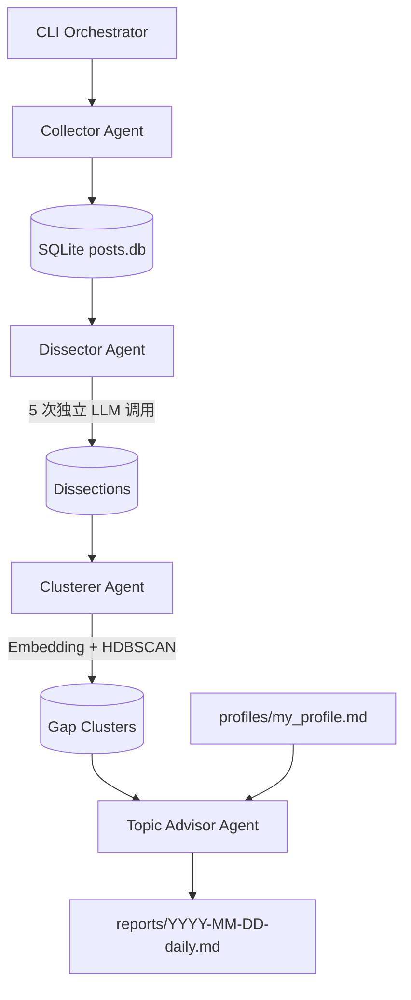

# Bao Kuan：爆款反向拆解 + 选题预判多 Agent 系统

Bao Kuan 不是内容生成器，而是一个「元层级内容研究 Agent」。它每天采集指定赛道的爆款内容，拆解为什么爆、评论区还在追问什么、作者刻意或无意避开了哪些暗面，最后反推出 3 个「我能写、但没人在写」的选题。

## 项目定位

独立创作者最大的隐性焦虑不是「写不出来」，而是「写了没人看」。多数工具在帮人写得更快，本系统更关注写得更对：用爆款样本和评论区需求来做选题预判。

## 架构图



## 快速开始：Mock 模式 Demo

```bash
python -m venv .venv
source .venv/bin/activate  # Windows: .venv\Scripts\activate
pip install -r requirements.txt
cp .env.example .env
export MOCK_MODE=true       # Windows PowerShell: $env:MOCK_MODE="true"
python -m bao_kuan daily
```

成功后会看到类似输出：

```text
daily_done posts=8 dissections=8 clusters=3 advices=3 report=reports/2026-05-22-daily.md
```

日报会生成在 `./reports/YYYY-MM-DD-daily.md`。

## 常用命令

```bash
python -m bao_kuan collect --niche "独立开发"
python -m bao_kuan dissect --since 7d
python -m bao_kuan cluster --window 7d
python -m bao_kuan advise --profile profiles/my_profile.md
python -m bao_kuan daily --niche "独立开发" --window 7d
```

## 配置说明

复制 `.env.example` 为 `.env` 后配置：

| 变量 | 说明 |
|---|---|
| `MOCK_MODE` | `true` 时采集和 LLM 都走内置 mock，可完整跑通 demo |
| `OPENAI_API_KEY` | OpenAI 或兼容服务的 key |
| `OPENAI_BASE_URL` | OpenAI 兼容接口 base URL，默认 `https://api.openai.com/v1` |
| `OPENAI_CHAT_MODEL` | Chat 模型名，默认 `gpt-4o-mini` |
| `OPENAI_EMBEDDING_MODEL` | Embedding 模型名，默认 `text-embedding-3-small` |
| `DATABASE_URL` | SQLAlchemy URL，默认 `sqlite:///data/posts.db` |

所有 LLM 调用都通过 `bao_kuan/llm_client.py`，使用 `chat.completions.create`，并把 token usage 记录到 `logs/llm_usage.log`。

## Agent 输入输出示例

### Collector Agent

输入：

```bash
python -m bao_kuan collect --niche "独立开发" --platforms "xhs,bilibili"
```

输出字段：

```json
{
  "platform": "小红书",
  "title": "我用 7 天验证了一个独立开发产品，结果最有用的是这张表",
  "opening_text": "很多人以为独立开发失败是产品不够好...",
  "interaction_data": {"likes": 1200, "comments": 180, "shares": 60, "collects": 300},
  "top_comments": ["能不能公开一下收入和成本？"],
  "url": "https://mock.local/...",
  "published_at": "2026-05-22T...Z",
  "collected_at": "2026-05-22T...Z",
  "raw_meta": {"mock_index": 0, "niche": "独立开发"}
}
```

### Dissector Agent

输入：最近 7 天未拆解 posts。  
输出：每条内容 5 个独立字段：

- `step1_angle`
- `step2_hook`
- `step3_structure`
- `step4_comment_needs`
- `step5_dark_sides`

### Clusterer Agent

输入：过去 N 天所有 `dark_sides`。  
输出：

```json
{
  "theme": "失败后的止损、成本与替代获客路径",
  "frequency": 24,
  "samples": ["产品冷启动失败后的止损标准和复盘模板"],
  "strength_score": 100.0
}
```

### Topic Advisor Agent

输入：缺口列表 + `profiles/my_profile.md`。  
输出：

```json
{
  "title_options": ["独立开发失败 90 天：什么时候该停手？"],
  "angle": "用反共识切入，把“坚持就是胜利”改写成“会止损才是能力”。",
  "predicted_interaction_range": {"low": 1800, "high": 6800},
  "writing_points": ["先给出明确止损阈值"],
  "risks": ["写得太丧会变成情绪劝退"]
}
```

## 设计决策与假设

1. 平台 Adapter 只实现合规架构骨架；mock 模式提供 8 条预制数据，保证没有 API key 也能跑通。
2. 去重使用 `url + title` hash，因为不同平台的原始 ID 不统一。
3. 拆解 Agent 强制 5 次独立 LLM 调用，并每步落库，优先保证可调试性。
4. 聚类在 `hdbscan` 不可用时降级到 `sklearn.DBSCAN`，避免 demo 因原生依赖安装失败中断。
5. Mock 模式下 embedding 使用稳定 hash 向量，避免引入本地模型下载。
6. 预测互动区间是启发式估算，不应被当成真实流量承诺。

## 测试

```bash
pytest
```

当前包含 `tests/test_dissector.py`，覆盖：

- 5 次 LLM 调用是否严格执行
- `insufficient_evidence` 是否落库
- 单条拆解失败是否被标记为 failed 而不是向外抛出

## Roadmap

- [ ] 接入真实小红书/B 站/即刻/X 官方 API 或合规数据供应商
- [ ] 增加平台侧评论分页与高赞评论排序
- [ ] 引入更稳定的中文 sentence-transformers 本地 embedding 选项
- [ ] 给缺口强度加入时间衰减和平台权重
- [ ] 增加 Web UI 和日报邮件推送
- [ ] 加入选题发布后的反馈回流，做预测校准

## License

MIT
